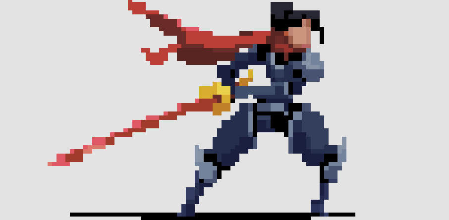

# batimg
<p align="center">
  
</p>

`batimg` is a small program written in Rust, designed to be fast and compatible with every terminal.   
It can print images and play videos in almost [every format](https://ffmpeg.org/ffmpeg-formats.html) in your terminal.

## Build
Build bin and install dependencies: `cargo build --release`  
Bin location: `./target/release/adplay`

## Usage
```
USAGE:
    batimg [OPTIONS] <FILE>

ARGS:
    <FILE>    Path to the media

OPTIONS:
    -d, --debug         Print debug stats
    -a, --audio         Play video audio (unstable)
    -h, --help          Print help information
    -l, --loop          Loop the video 
    -s, --size <u32>    Canvas size
    -r, --resolution    Disable high resolution mode (half pixel character)
    -p, --prerender     Export frames first (unstable)
    -t, --timesync      Disable realtime synchronization
    -V, --version       Print version information

EXAMPLES: 
    batimg img.png
    batimg img.jpg -s 100
    batimg video.mp4 -a
    batimg animation.gif
```
## Goals

- [x] Show images
- [x] Play videos
- [x] Play audio
- [x] Improving the resolution
- [ ] Improving cleaning escape codes
- [ ] Getting rid of FFmpeg high CPU usage (Frame extraction)

## batimg vs catimg

<div align="center">
	<table>
	<thead>
	  <tr>
	    <th></th>
	    <th><b>batimg</b></th>
	    <th><b>catimg</b></th>
	  </tr>
	</thead>
	<tbody>
	  <tr>
	    <td><b>creation date</b></td>
	    <td>2021</td>
	    <td>2013</td>
	  </tr>
	  <tr>
	    <td><b>language</b></td>
	    <td>rust</td>
	    <td>shell/c</td>
	  </tr>
	  <tr>
	    <td><b>format</b></td>
	    <td>
	        <a href="https://ffmpeg.org/ffmpeg-formats.html">
	        almost all
		</a>
	    </td>
	    <td>png/jpg/gif</td>
	  </tr>
	  <tr>
	    <td><b>dependencies</b></td>
	    <td>ffmpeg (videos)</td>
	    <td>imagemagick</td>
	  </tr>
	  <tr>
	    <td><b>resize algorithm</b></td>
	    <td>nearest neighbor</td>
	    <td>nearest color</td>
	  </tr>
	  <tr>
	    <td><b>resolution</b></td>
	    <td>▀ / █</td>
	    <td>▀ / ██</td>
	  </tr>
	  <tr>
	    <td><b>video support</b></td>
	    <td>yes</td>
	    <td>no</td>
	  </tr>
	  <tr>
	    <td><b>audio support</b></td>
	    <td>yes</td>
	    <td>no</td>
	  </tr>
	  <tr>
	    <td><b>CPU usage</b></td>
	    <td>medium (images) high (videos)</td>
	    <td>medium</td>
	  </tr>
	  <tr>
	    <td><b>prerendering</b></td>
	    <td>Disabled by default</td>
	    <td>Always enabled</td>
	  </tr>
	  <tr>
	    <td><b>time sync</b></td>
	    <td>Enabled by default</td>
	    <td>Seems enabled, but not on every gif</td>
	  </tr>
	</tbody>
	</table>
</div>

<p align="center">
  
</p>

<p align="center">
Rendering comparison on pixel arts.
</p>

