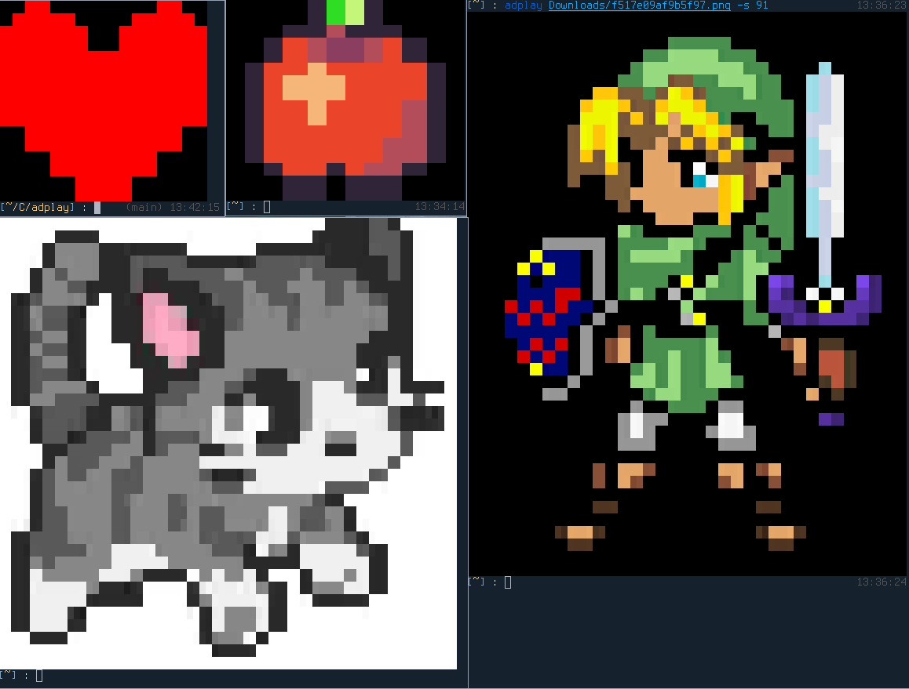

# ADPlay
ADPlay (ASCII-Drip play): Graphic content on your terminal (works better on pixel arts)

<p align="center">
  
</p>

## Build
Build bin and install dependencies: `cargo build --release`  
Bin location: `./target/release/adplay`

## Usage
```
USAGE:
    adplay [OPTIONS] <FILE>

ARGS:
    <FILE>    Sets the input file to use

OPTIONS:
    -h, --help          Print help information
    -s, --size <u32>    Canvas size
    -V, --version       Print version information
```
Example: `adplay img.png`  
Need help ? Just use `adplay --help`
